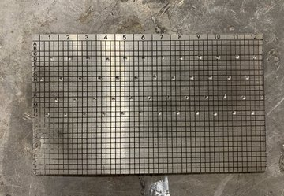
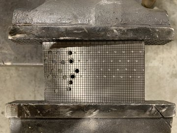
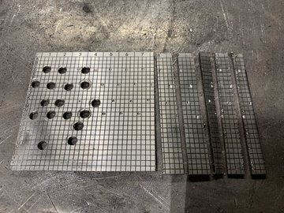
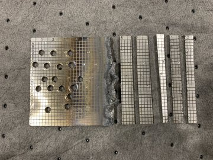

# Alternative methods for destroying a seed plate
The .44 magnum was the most destructive of the calibers we tested. A friend of a friend who was supposed to have the .50 cal  bailed out at the last minute. We were going to go to Colorado Springs and rent a .50 cal from [Dragon Man](https://dragonmans.com/) but they wouldn't let us bring steel targets onto the range. Shooting the plates was more efficient than drilling holes, cutting with a saw, or melting with a torch. As demonstrated in this video:

With the drill you have to make too many holes to randomize the pattern. With the saw you have too many pieces that you have to distribute to different geographic locations so the plate can't be put back together. The torch leaves no trace, but it's not for amateurs.

  
  
  
  

 

I hope you found this thought provoking & useful. Thank you to [@nvk](https://twitter.com/nvk) & @Coinkite for giving us the plates for our research! And special credit goes to my buddy [@waleehooha](https://twitter.com/waleehoohaa) for supplying the cameras & editing all the video footage! If you want some videos made he takes bitcoin.

Here are links to the hi-def videos:

.22 https://youtu.be/JY6kghag4-w

9mm https://youtu.be/CjIYGjix1wQ

7.62 https://youtu.be/-R-fuaMr8Nc

.44 https://youtu.be/cp0TdyoD0P4

Playlist: https://www.youtube.com/playlist?list=PLXFg0Lg1IYMik5QJY79czMydErguppBJA 

Thanks for reading! I hope you give some consideration to how you handle robust seed backups after you're finished with them. 
