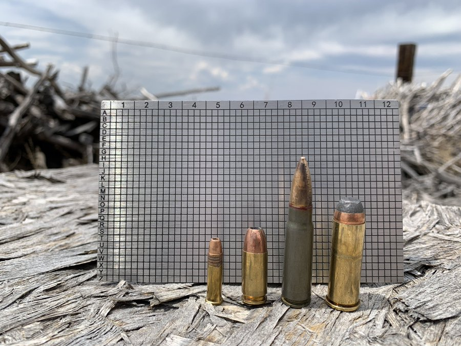
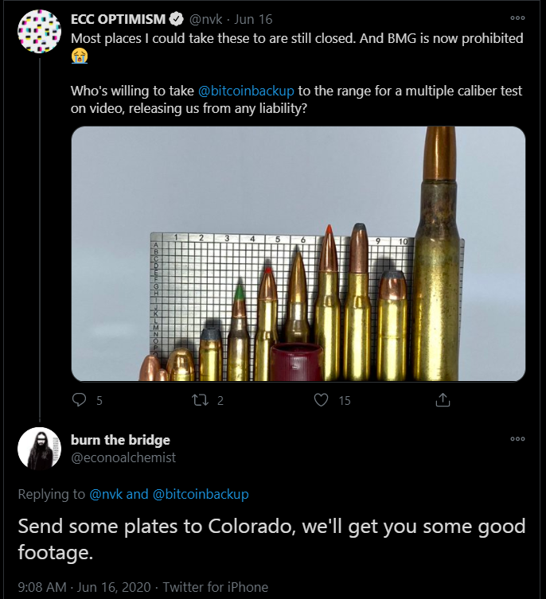

# Shooting Seed Plates: Where do backups go when they die?
An exploration into the various seed destruction methods on the heavy duty, 2mm, 304 stainless steel [@bitcoinbackup](https://twitter.com/bitcoinbackup?lang=en) from [@Coinkite](https://twitter.com/coinkite?lang=en).

2020-06-16: While Canadian authorities continued their crusade to ban, not only BMG .50 caliber rifles, but also the great outdoors, resourceful citizen, @nvk, turns to Twitter and posses the question: 

### “Who's willing to take @bitcoinbackup to the range for a multiple caliber test on video, releasing us from any liability?”

 

I knew right away that it was my duty as a freedom loving Bitcoiner to step up to the challenge and help a friend in need. At the time, I wasn't sure how I would do it, where I would find a BMG, or if I would spend the rest of my days trying to outrun the Royal Canadian Mounted Police. But a couple of DM's later and an email to CoinKite support with shipping instructions and the wheels were in motion.

# But why?
SeedPlates offer a robust method for securing Bitcoin mnemonic phrases. Usually, a wallet will produce 12 or 24 words that the user needs to keep safe. Taking a picture of the words, typing the words in a document, scanning the words into a .pdf, or digitizing the words in any way is frowned upon as this widens the attack surface considerably. Writing the words down on paper with ink is recommended but this too has drawbacks like fire or water damage. Steel plates can be used to protect against digital interception and environmental harm. With these particular seed plates, the English alphabet runs along the X-axis and 4-column wide sections run along the Y-axis. The user only needs to stamp the first four letters of each word as that is all that is needed for a BIP39 compatible wallet to regenerate, no two words on the BIP39 word list have the same four letters.  

Suppose for moment that you drained all your bitcoin from an old wallet. Is it safe to just throw the old backup in the trash? If you had KYC bitcoin in that wallet, then some of those addresses are tied to your name. How would you feel if someone signed a message from an address tied to your name?

Properly destroying your seeds is important for preserving privacy even after the wallet is no longer used. 
